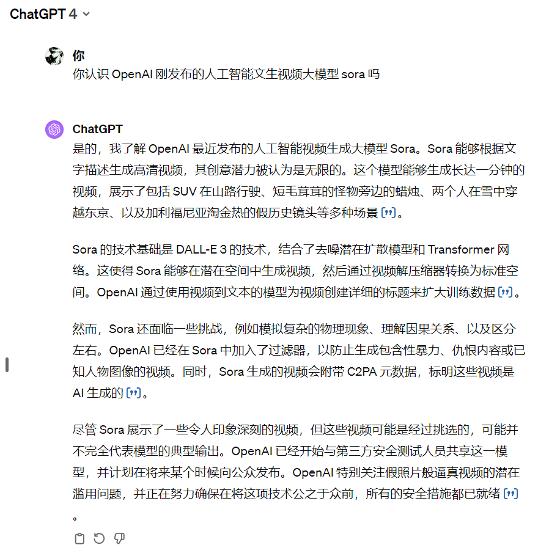
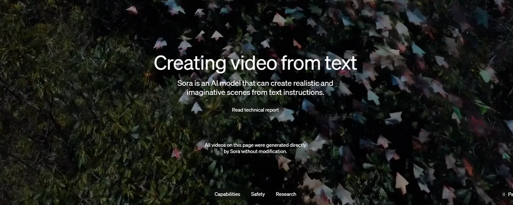
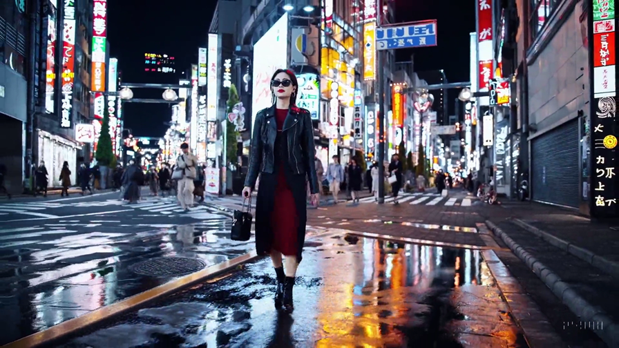
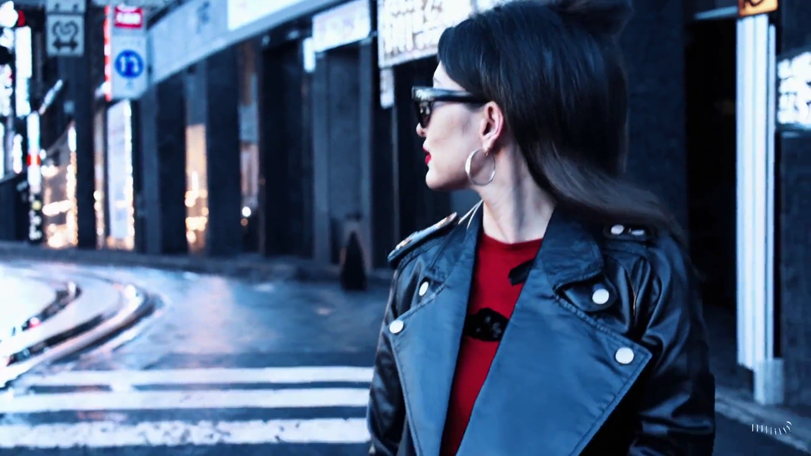
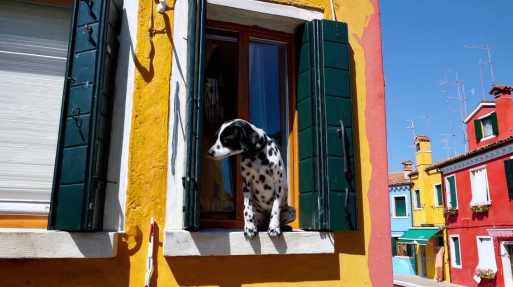
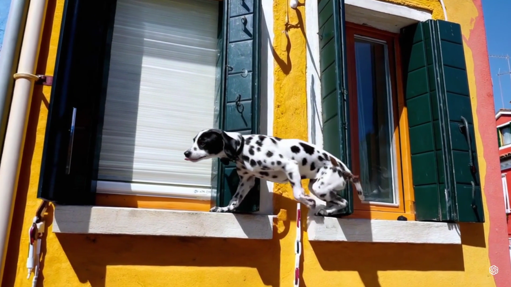
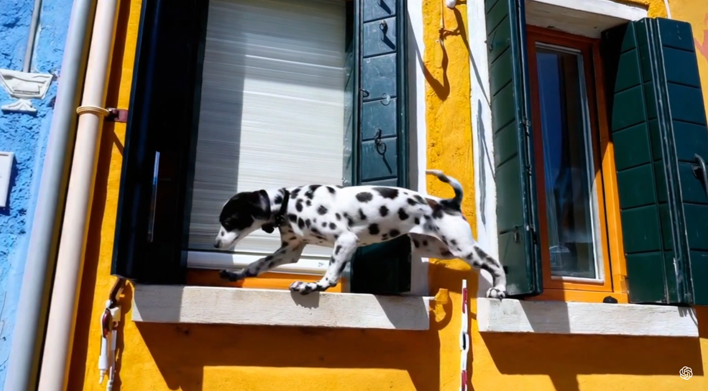
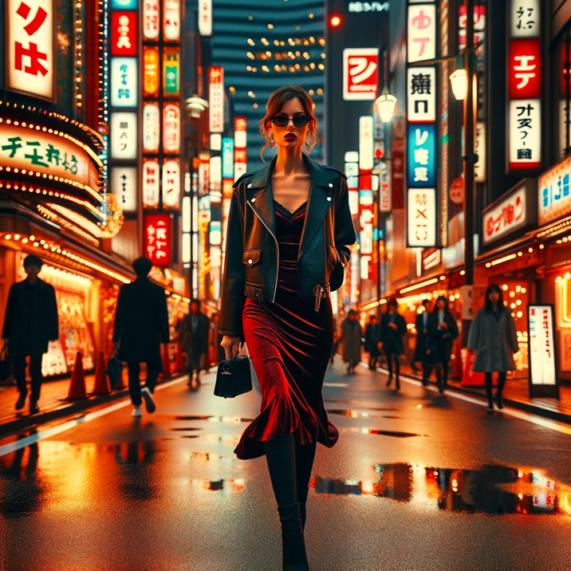
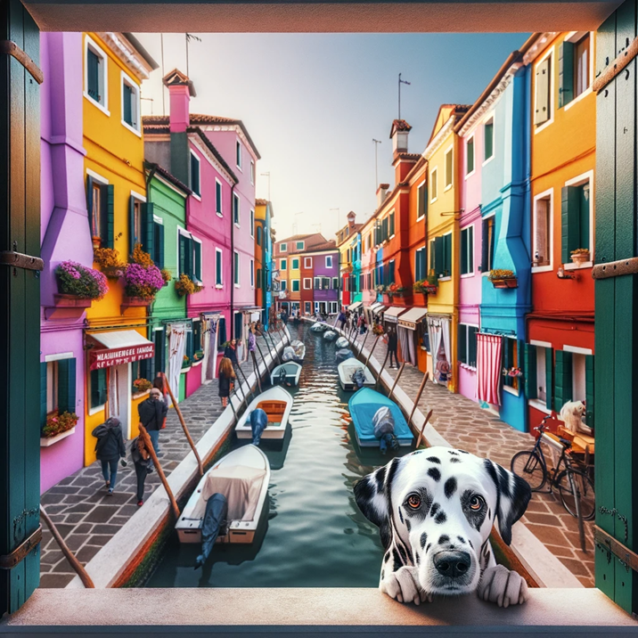

## Sora 是什么
我们先来看看看GPT4怎么回答的：

GPT4 的回答还是很准确的，总结以下几点：
1. Sora 能够根据文字描述生成长达一分钟的高清视频
2. Sora 的技术基础是 DALL-E 3 的技术，也就是 GPT4 现有的能力
3. Sora 的能力还有待提升，我们看到的视频是经过筛选的，并不是其典型能力

（PS：目前OpenAI只对部分用户开放了Sora的使用权限，如果想体验 GPT4 文生图，可以看这个教程 [如何升级 ChatGPT 4.0](update_gpt4.md)）

## Sora 官网
我们通过官网 https://openai.com/sora 探究一下 Sora，官网中所有的视频均是 sora 直接生成的。

#### 样例一

第一个就是最近很火的那个视频，视频生成的提示语如下：

> Prompt: A stylish woman walks down a Tokyo street filled with warm glowing neon and animated city signage. She wears a black leather jacket, a long red dress, and black boots, and carries a black purse. She wears sunglasses and red lipstick. She walks confidently and casually. The street is damp and reflective, creating a mirror effect of the colorful lights. Many pedestrians walk about.
> 
翻译：“一位时尚的女士走在东京的街道上，街道上充满了温暖的霓虹灯和生动的城市标志。她穿着黑色皮夹克、红色长裙和黑色靴子，手里拿着一个黑色钱包。她戴着太阳镜和红色口红。她走路自信而随意。街道潮湿且反光，形成了彩色灯光的镜面效果。许多行人走来走去。”

视频中的女人在移动时，与后面的街道背景一直保持高度稳定和流畅；而且视频中对光影反射、运动方式、镜头移动等细节都处理得更好，让观众看起来跟真实拍摄的一样。

#### 样例二
还有一个比较有趣的视频是：
> Prompt: The camera directly faces colorful buildings in Burano Italy. An adorable dalmation looks through a window on a building on the ground floor. Many people are walking and cycling along the canal streets in front of the buildings.
> 
翻译：相机正对意大利布拉诺岛色彩缤纷的建筑。一只可爱的斑点狗透过一楼建筑的窗户向外张望。许多人沿着建筑物前的运河街道步行和骑自行车

这个视频给人的第一感觉就是他是真的，视频中的阴影很符合现实世界，在狗狗动的同时阴影也随之而动，同时，小狗的尾巴在视频中很真实。

## GPT4 VS Sora
**GPT-4 图片生成能力**
> GPT-4通过与DALL-E模型的集成，能够根据文字描述生成静态图片。用户提供一个文本提示，GPT-4处理并可能增强该提示，以便DALL-E能够更好地理解和视觉化提示内容，进而生成图片。这一过程涉及诸如构图、颜色、光线和质感等方面的决策。GPT-4还能够理解复杂的请求，并在提示中包含具体的细节，如特定的物体、颜色、光照和情绪，确保生成的图片尽可能符合用户的愿景​​。
DALL-E的能力包括控制场景的视点和3D风格、生成具有细节的内部和外部结构、以及根据文本提示在图像上添加特定文本。它还能够在一定程度上处理反射和光学畸变。然而，DALL-E在处理多个对象及其颜色关系、创建准确的3D表示以及在不同语义等价的描述之间保持一致性方面存在局限性​​。

**Sora 视频生成能力**
> Sora是一种基于DALL-E技术的视频生成模型，能够将文字描述转化为高清视频。与GPT-4生成静态图像不同，Sora能够创建动态内容，包括复杂场景和历史事件的视频。Sora采用去噪潜在扩散模型与Transformer网络的结合，通过在潜在空间中生成视频然后转换为标准空间来工作。Sora能够从其数据集中学习创建3D图形，并自动从不同角度创建视频，无需特定提示。此外，Sora生成的视频会附带C2PA元数据，表明这些视频是AI生成的​​。
然而，Sora也面临挑战，如模拟复杂物理现象、理解因果关系以及区分左右方向的困难。尽管如此，它的创新之处在于将视频分割成可以处理的块，并利用Transformer处理这些数据块，就像处理文本数据一样​​。

**优缺点对比**
> GPT-4与DALL-E的集成允许用户探索静态图像的创造，具有相对高的控制度和细节性。它适用于生成具有特定主题、风格或细节要求的图像。然而，生成的图像可能会受到限制，特别是在处理复杂场景和多个对象时。
Sora则扩展了生成能力到动态视频，能够表现时间维度上的变化和连贯性。这为创造更丰富和动态的内容提供了可能，但在确保视频中对象的长期一致性和处理复杂交互方面仍有挑战。

总的来说，GPT-4和Sora各自在图像和视频生成方面展现了AI的强大潜力，同时也揭示了当前技术在理解和表现复杂现实世界场景方面的限制。随着技术的进步，这些模型的能力和应用范围预计将继续扩展。

GPT4 也具有文生图的功能，使用与 sora 相同的提示语 GPT4 会能成什么样的图片呢
**展示魔法的时刻**
**样例一** 

**样例二**

这里我并没有指定风格，但从单张图片来看，图片质量要比视频更高清，细节更丰富。

**总结**：Sora 已经具有了文成高清视频的能力，并且基本能够达到以假乱真的效果，但是 Sora 模型能力还有待提高，目前并不能稳定生成高质量视频。如果想体验文生图的功能可以使用 GPT4。
