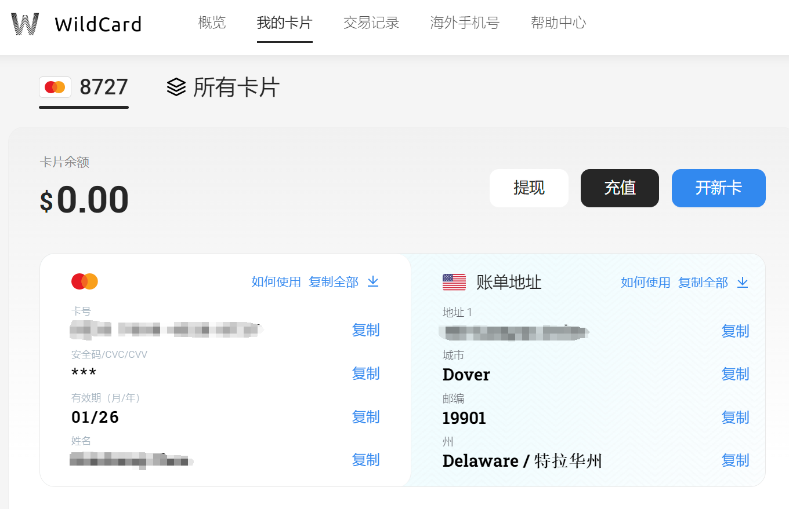
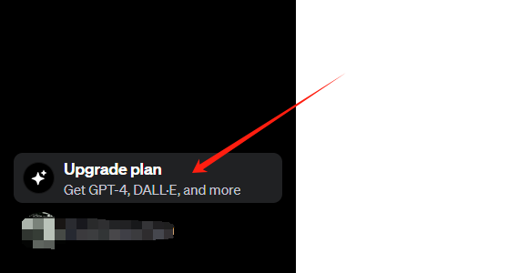
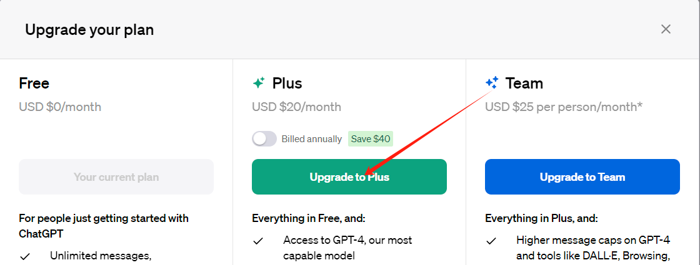
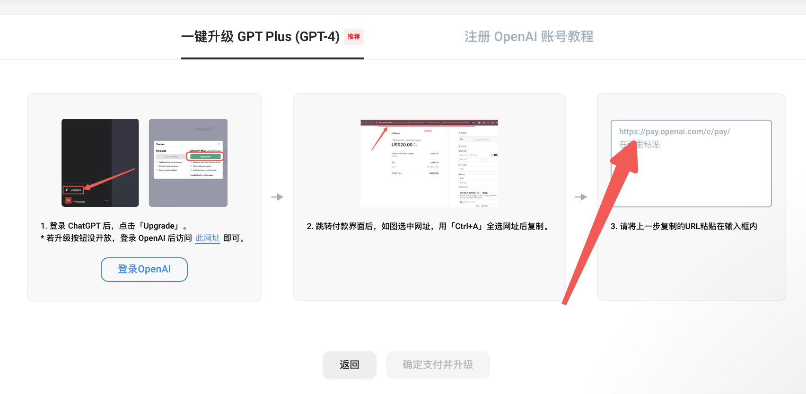

## 如何升级 ChatGPT 4.0

1. 申请一张国外虚拟信用卡
2. 访问ChatGPT网站，点击升级
3. 通过虚拟卡平台一键升级

### 一、申请虚拟卡
然而由于官方限制，ChatGPT在国内无法直接访问，而ChatGPT 4.0在此基础上还必须绑定国外的信用卡才能开通，这门槛确实挡住了不少人……
不过方法总比困难多，经过一晚上的折腾，成功开通会员！

申请虚拟卡推荐 wildcard 平台：[https://bewildcard.com](https://bewildcard.com/i/GPT4666)
注册的时候如果没有填邀请码，可以手动填入 **GPT4666** 邀请码，可以免 2 美元的开卡费～

这是一个正规虚拟卡平台（支付宝可以充值），提供海外软件订阅服务，如 ChatGPT、亚马逊、YouTube等，开卡之后可以用 2 年，并且提供了一键升级Chat和一键注册账号的能力
虚拟卡如下：

### 二、访问ChatGPT主页
进入 [ChatGPT 主页](https://chat.openai.com/) 点击升级 Upgrade Plan，选择 Plus

### 三、升级ChatGPT
将升级页面的链接填到 wildcard 平台一键升级框中，确认并升级
**注意提前将ChatGPT订阅费用充值到虚拟卡中，也是使用支付宝**

大家如果有任何问题，欢迎留言咨询，也可以提供账号代充值和升级～
