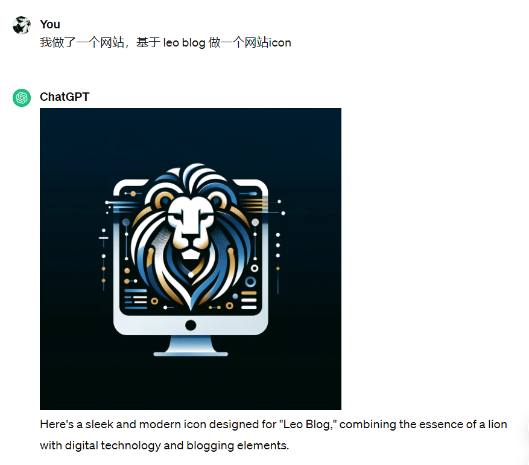
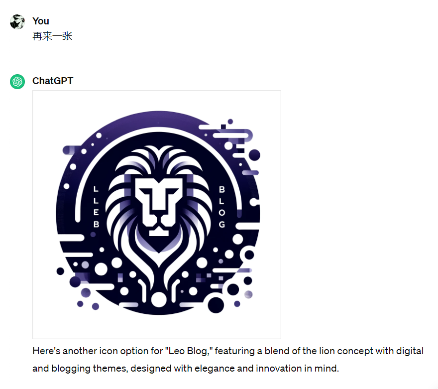
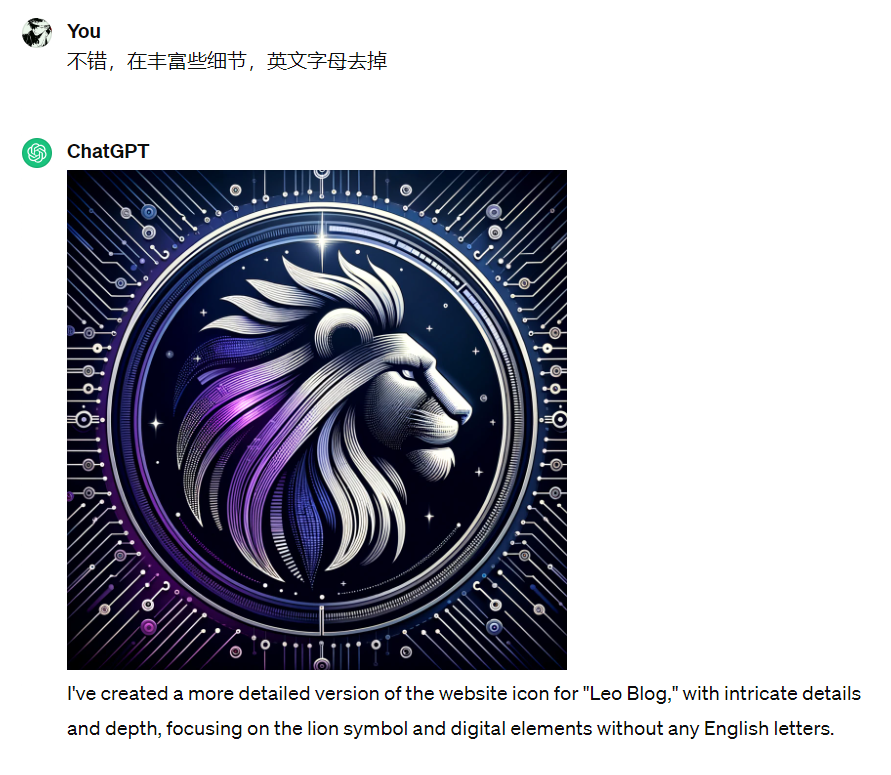
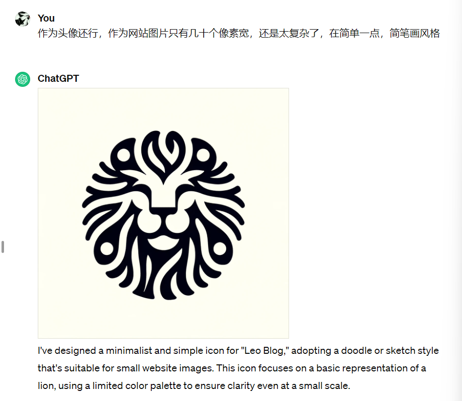
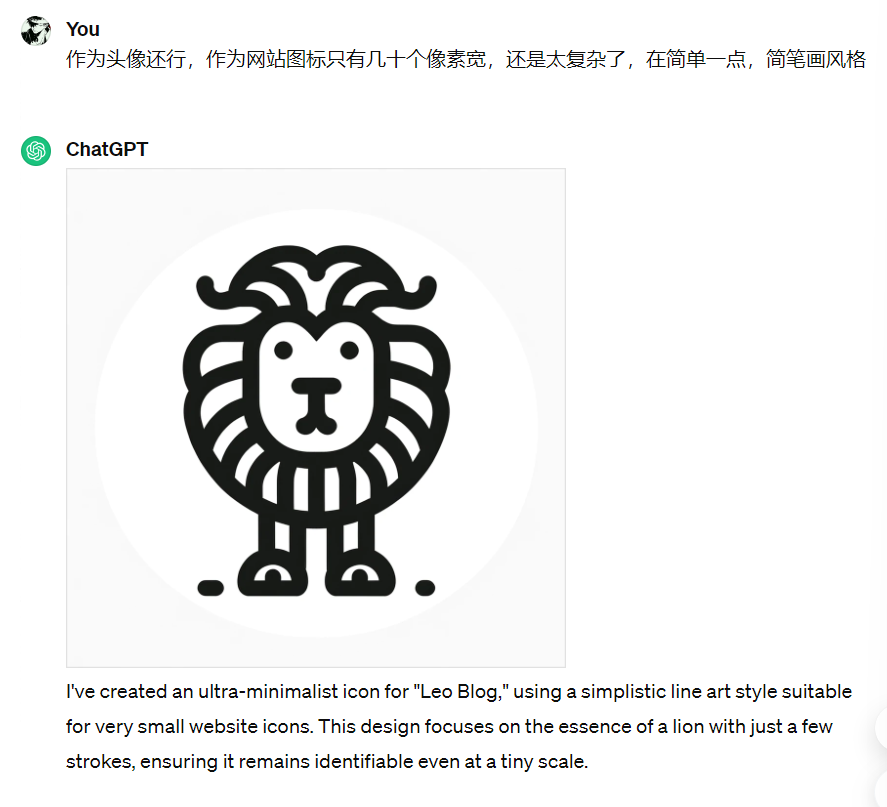
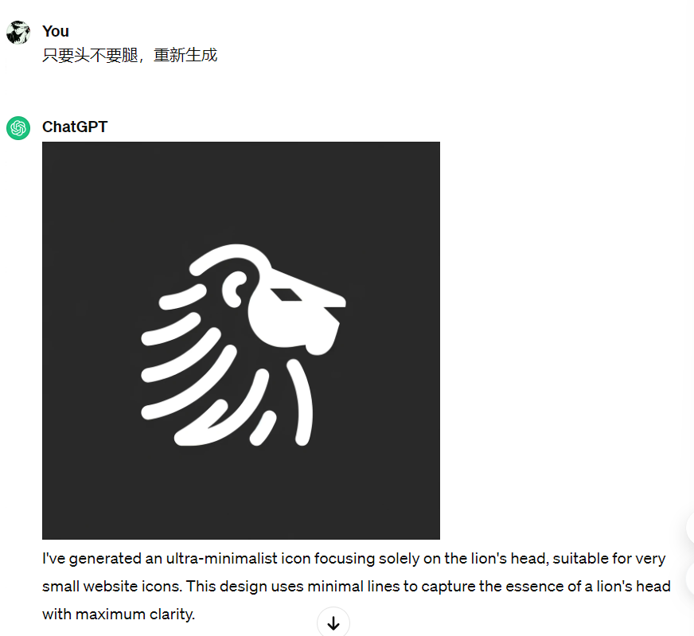

最近刚开通了 ChatGPT4，正好要设计一个网站图标，想测试一下它AI绘图的能力，让它根据文字描述生成一个想象中的图标

**（PS：如果想体验 GPT4 文生图，可以看这个教程 [如何升级 ChatGPT 4.0](update_gpt4.md)）**

**第1次交互**

第一次的描述很简单，但生成效果还不错，基于关键词 "leo blog" 生成了一个狮子在电脑显示器的形状，同时我强调了是 icon 图标，生成的图片背景是纯黑色，也很合理，不得不感叹 GPT4 文生图的能力。

**第2次交互**

第二次主要也是狮子的为核心，还加了字母，但这里字母是错的，根据我多次文生图经验来看，GPT4在图像上生成文字很不靠谱

**第3次交互**

第三次我让GPT4 去掉了字母，并丰富下细节，这个图片确实不错，可以作为头像使用，细节确实很足。但我想要的是网站 icon，这么复杂缩小后啥也看不出来，我们继续提问

**第4次交互**

GPT4 根据指定的风格生成了一个简笔画，看着还不错，但不是想要的还是有点复杂，同样的话有重新生成一次。

**第5次交互**

这个就太简笔画了，有点儿童简笔画的感觉，没啥设计感，我们继续

**第6次交互**

这张挺好的，最后我选的也是这张图作为网站的图标，很简洁，也很有设计感。

整体来看，我完全没用任何提示语，就大白话，描述还少，但几轮下来 GPT4 生成了我想要的东西，GPT4 的AI绘图的能力真强！！！

如果你喜欢这篇文章，记得给我点个关注哦~
